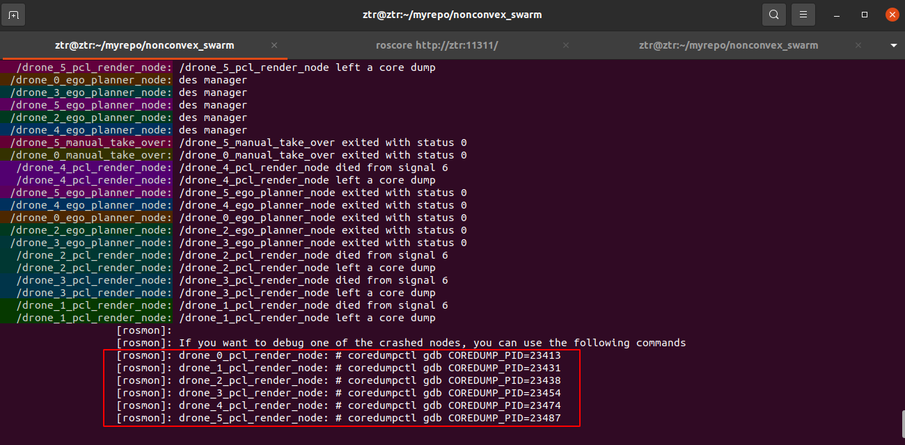

# coreDump:debug
## 注意Debug模式编译ros节点,去掉-O3优化,Release等
- 概念参见[三步搞定ROS进程崩溃-Core Dump](https://zhuanlan.zhihu.com/p/459530578),详情如下
### 推荐安装工具
- sudo apt install systemd-coredump
- sudo apt install ros-noetic("DISTRIBUTION")-rosmon
使用[monlaunch](https://github.com/xqms/rosmon)代替roslaunch后启动节点,可用如下命令代替gdb传统方式对coredump文件分析
```cpp
coredumpctl gdb COREDUMP_PID=xxxxx  
然后使用bt或者bt full查看函数栈之Backtraces定位某一行代码
```

补充博客参见["在 Linux 上创建并调试转储文件"](https://blog.csdn.net/weixin_33941707/article/details/112592730)使用systemd-coredump,或参见本地文件(Figures/notes/分析核心转储文件.png)


## 注意修改Linux默认4G的转储文件大小限制,避免转储文件过大被截断
- sudo vim /etc/systemd/coredump.conf 注意取消注释，ProcessSizeMax，ExternalSizeMax与JournalSizeMax
```cpp
[Coredump]
#Storage=external
#Compress=yes
ProcessSizeMax=8G
ExternalSizeMax=8G
JournalSizeMax=8G
#MaxUse=
#KeepFree=
```

