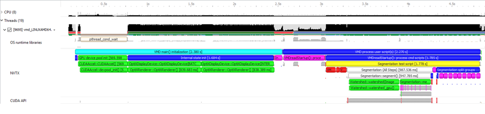
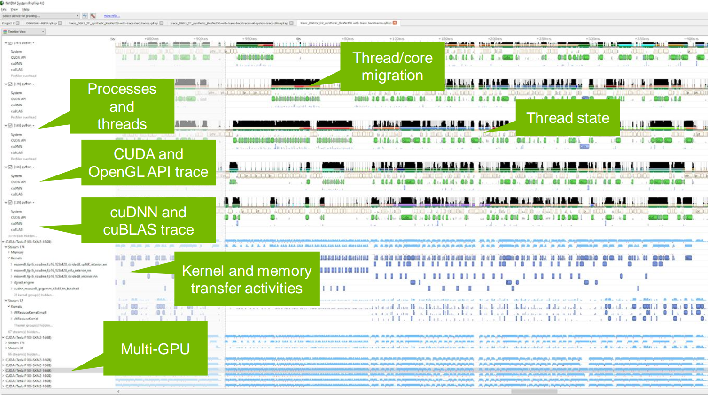
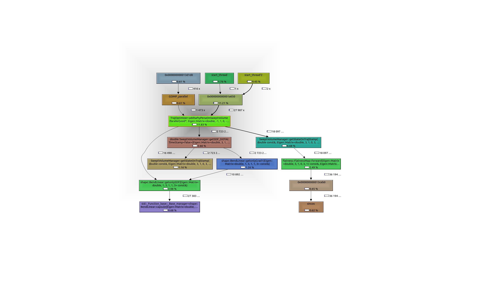
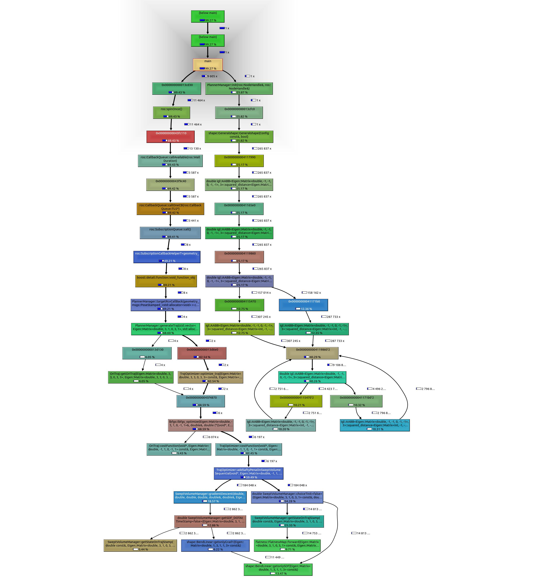
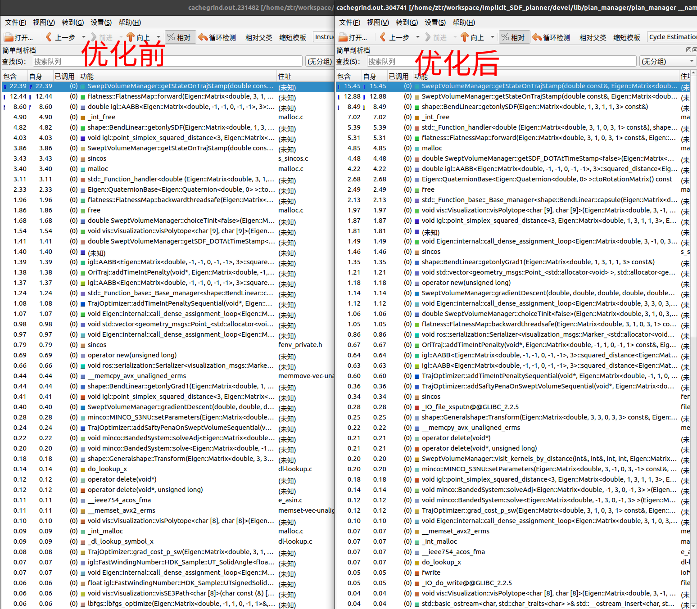

# CPU程序Profiling


## gperftools分析内存与cpu占用，官方文档

https://gperftools.github.io/gperftools/cpuprofile.html

https://github.com/ethz-asl/programming_guidelines/wiki/Profiling-Code

个人尝试推荐[使用方法](https://liam.page/2020/06/22/CPU-Profiler-in-gperftools-not-working/)，也可参见图片"Figures/notes/gperftools.png"
具体例如ego_planner_node:

```cpp
#include <ros/ros.h>
#include <visualization_msgs/Marker.h>
#include <gperftools/profiler.h>
#include <plan_manage/ego_replan_fsm.h>

using namespace ego_planner;

int main(int argc, char **argv)
{
  ProfilerStart("/home/ztr/Formation/heap/ego_planner_node.prof");
  HeapProfilerStart("/home/ztr/Formation/heap/ego_planner_node_memory.log");
  ros::init(argc, argv, "ego_planner_node");
  ros::NodeHandle nh("~");

  EGOReplanFSM rebo_replan;

  rebo_replan.init(nh);


  ros::spin();
  HeapProfilerStop();
  ProfilerStop();
  return 0;

//对应CMakeLists.txt多出一些行数如

target_link_libraries(ego_planner_node 
  ${catkin_LIBRARIES}
  profiler //分析CPU需要，
  tcmalloc//分析内存需要
  )
set (CMAKE_SHARED_LINKER_FLAGS "-Wl,--no-as-needed") #https://stackoverflow.com/questions/24532853/how-can-i-add-linker-flag-for-libraries-with-cmake


}
// 最后如下分析
google-pprof --pdf devel/lib/ego_planner/ego_planner_node heap/ego_planner_node.prof > test.pdf
```
- [函数调用效果1](Figures/notes/pprof.pdf)
- [函数调用效果2](Figures/notes/pprof2.pdf)
## 获得所有函数调用的情况

### 注意为了显示出全部函数调用的情况，需要在各个link的库中添加头文件，添加代码避免被编译器优化
```cpp

#include <gperftools/profiler.h>

并且代码当中添加如下

 volatile bool tmp = false;
if (tmp) ProfilerStop();
CMakeLists.txt中链接profiler如下
target_link_libraries( traj_opt
${catkin_LIBRARIES}
profiler
)
```
## 整体类似与NVTX CUDA profiling一样,需要打桩,使用起来不如valgrind方便

# Cuda程序Profiling
# GPU profiling 
- nsys profile -t nvtx,cuda  --stats=true -f true -o withouteigen terrain_analyzer
nsight-sys

[墙裂推荐Nsight System](Doc/nsight.pdf)结合nvtx



# ROS节点profiling

## 墙裂推荐Valgrind & callgrind &cachegrind & 再使用kcachegrind分析相对而言更加好用
- 参见[ros下debug, profiling工具](Figures/notes/profiling_roslaunch_prefix.md) 
- 类似可参考[profiling](Figures/notes/profiling1.pdf)与[valgrind_or_gdb](Figures/notes/profiling2.pdf)
## 使用valgrind注意输出的文件在~/.ros/下,之后用kcachegrind导入
### kcachegrind callgrind.out.xxx_pid或者kcachegrind cachegrind.out.xxx_pid类似,GUI有时候不能找到文件，命令行打开

```cpp
# Callgrind试例
    <node pkg="plan_manager" type="plan_manager" name="plan_manager" output="screen" launch-prefix="valgrind --tool=cachegrind --branch-sim=yes"> 
        <rosparam file="$(find plan_manager)/config/config.yaml" command="load" />
    </node>
# Cachegrind试例
    <node pkg="plan_manager" type="plan_manager" name="plan_manager" output="screen" launch-prefix="valgrind --tool=callgrind  "> 
        <rosparam file="$(find plan_manager)/config/config.yaml" command="load" />
    </node>
```
## 分析CPU耗时,函数调用占比等



## 分析cachemiss缓存性能
